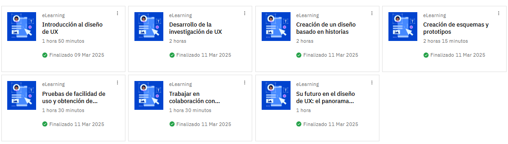
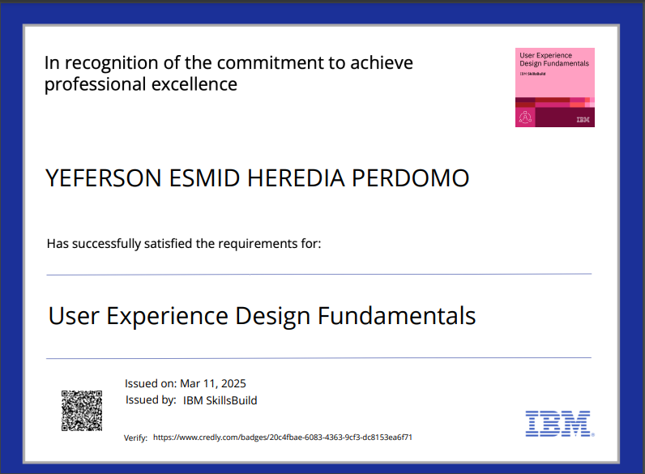

# Documentación sobre Diseño UX

### Requisitos del proyecto
- Detalles de la aplicación o sitio web a diseñar o rediseñar.
- Posibles retos de los usuarios.
- Objetivos como diseñador de UX.

### Usuarios prototipo y análisis de la competencia
- Representación ficticia de un usuario objetivo basada en investigación.
- Evaluación de tendencias del sector, mejores prácticas y expectativas.
- Análisis FODA para evaluar fortalezas, oportunidades, debilidades y amenazas.
- Mapas de recorrido del usuario y mapas perceptuales.
- Marco HEART (Felicidad, Implicación, Adopción, Retención y Éxito de las tareas).

## ¿Qué es un usuario prototipo?
- Creación basada en datos y no en suposiciones.
- Uso para mantener un enfoque centrado en el usuario y alinear decisiones con sus necesidades.

## Recorrido de usuario
- Representación visual de pasos e interacciones del usuario.
- Evaluación de necesidades, dificultades y preferencias.

### Flujo de usuario y flujo de tareas
- Diagrama de pasos específicos que sigue el usuario.
- Desglose de acciones detalladas dentro del recorrido.

## Introducción a la generación de esquemas
- Representación visual de la estructura de un producto digital.
- Permiten definir la funcionalidad y priorizar contenidos.

### Tipos de esquemas
- Esquemas reactivos: diseños fluidos y flexibles adaptados a dispositivos.

## Historias de usuarios
- Redactadas desde la perspectiva del usuario.
- Formato estructurado en rol, acción y ventaja.

## Prototipos en UX
- Representación interactiva de un producto digital.
- Simulación y prueba de experiencia de usuario.
- Herramientas populares: Figma, Sketch, Adobe XD, InVision, Axure RP, Proto.io, Marvel, Principle.

## Pruebas de curso al 100%

### Iteración y pruebas
- Repetición de pruebas e incorporación de comentarios hasta la versión final lista para desarrollo.

### Imagen de actividades del curso 

### Imagen de certificado

