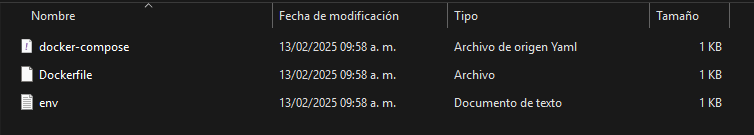
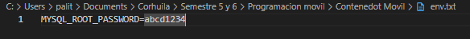
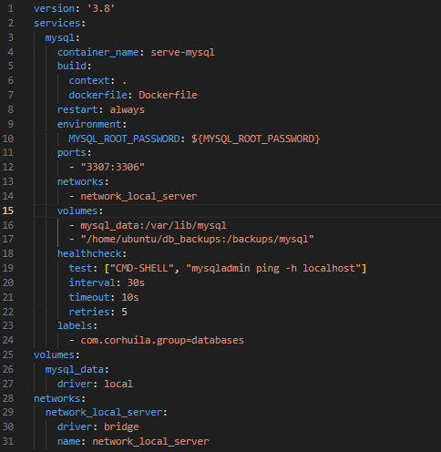
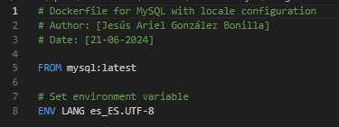
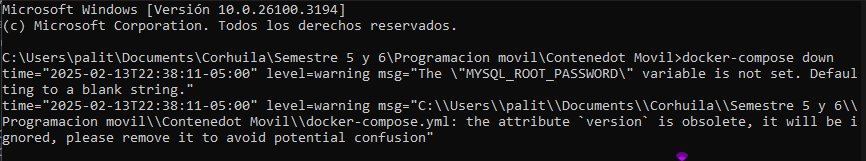
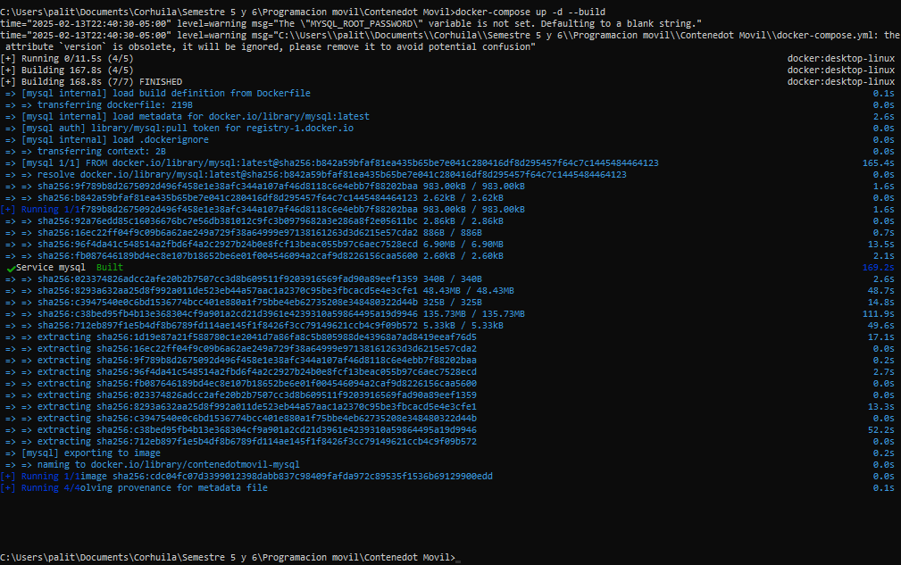
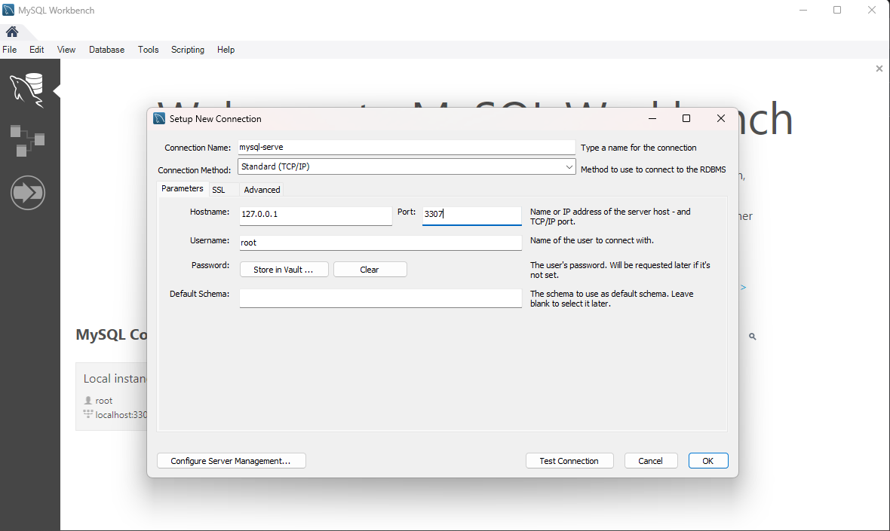
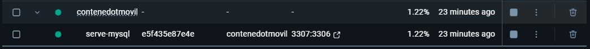
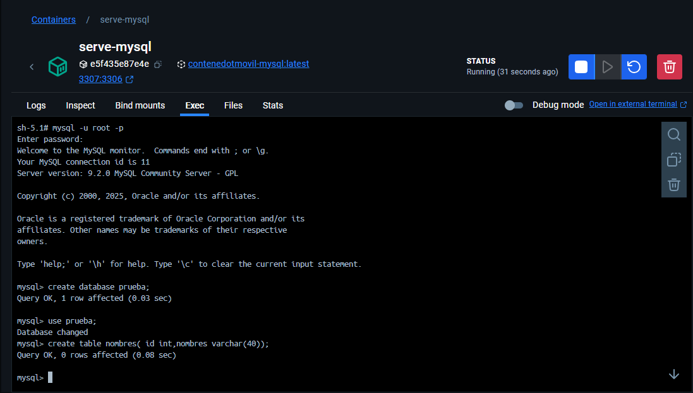
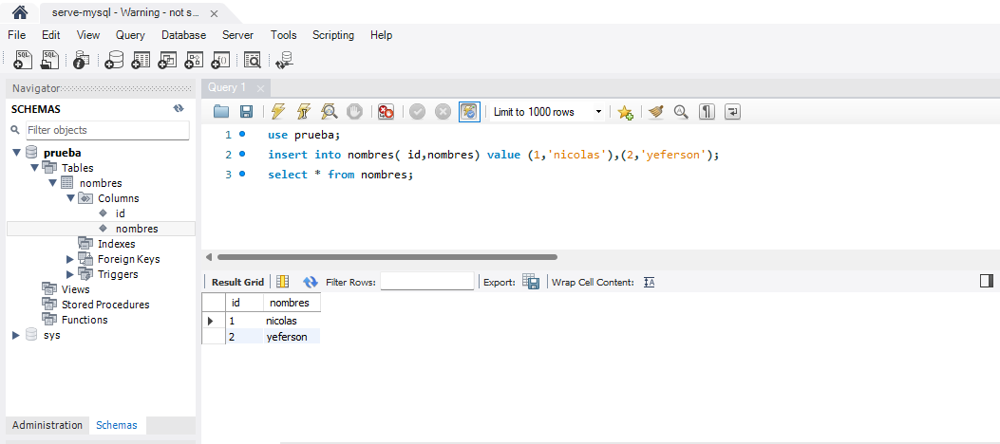

# CREACION DE CONTENEDOR DE DOCKER Y CONECTADO A Workbench

Este manual explica cómo crear un contenedor Docker y conectarlo a WorbEnh, cubriendo desde la configuración inicial hasta su ejecución. Con instrucciones claras y ejemplos prácticos, aprenderás a implementar esta tecnología de forma eficiente.

Para la creacion del contenedor se debe tres archivos principales:

- .env (Archivo de variables de entorno): Contiene configuraciones y credenciales sensibles como nombres de usuario, contraseñas y puertos, evitando que se escriban directamente en el código o en archivos de configuración.

- docker-compose.yml (Archivo de configuración de Docker Compose): Define y orquesta múltiples contenedores en una sola aplicación. Permite especificar imágenes, volúmenes, redes y variables de entorno para ejecutar servicios de manera coordinada.

- Dockerfile (Archivo de construcción de imagen Docker): Contiene instrucciones para crear una imagen de Docker personalizada, indicando qué sistema operativo usar, qué dependencias instalar y cómo ejecutar la aplicación dentro del contenedor

#### Imagen de referencia 

## Contenido de los archivos normalmente

### .env

### docker-compose

-  Verifica que el 3307 no este ocupado para el buen funcionamiento

### Dockerfile

## Creacion de contenedor 

Para la creacion del contenedor usaremos y tendremos presente tres comandos: 

#### docker build -t custom-mysql .

- Construye una imagen de Docker a partir del Dockerfile en el directorio actual (.).
- La imagen se etiqueta (-t) como custom-mysql.

#### docker-compose down

- Detiene y elimina los contenedores, redes y volúmenes definidos en docker-compose.yml.
- Es útil para limpiar la ejecución previa antes de levantar nuevos contenedores.

#### docker-compose up -d --build

- Levanta los contenedores definidos en docker-compose.yml.
- La opción -d ejecuta los contenedores en segundo plano (modo "detached").
- La opción --build fuerza la reconstrucción de las imágenes antes de iniciar los contenedores.

## Imagen de muestra de comandos 

###  docker-compose down
Mensaje de respuesta por parte de la consola al lanzar el comando 

### docker-compose up -d --build

Mensaje de respuesta por parte de la consola al lanzar el comando 

## Creacion del server en Workbench
Creamos la conecion de la instancia con el mismo puerto que configuramos en el archivo de docker-compose y el nombre de la instancia debe ser el mismo en este caso como aparece en la linea 4.

## Verificacion de vinculacion
Verificamos que el contenedor y serve-mysql este corriendo en docker.

### Consola docker

Nos conectaremos al mySQL por la consola de docker y creamos un base de datos como prueba , tambien creamos una tabla llamada nombres que tiene id ( int ) y nombre( varchar(40) ).

### Consola Workbench

Insertamos datos a la datos a la tabla que creamos en la consolad de docker usando asi mismo la base de datos que creamos en este caso : prueba.

# ¡Configuración completada con éxito! 🚀

El contenedor Docker ha sido creado y ejecutado correctamente, y la conexión con MySQL Workbench está establecida.