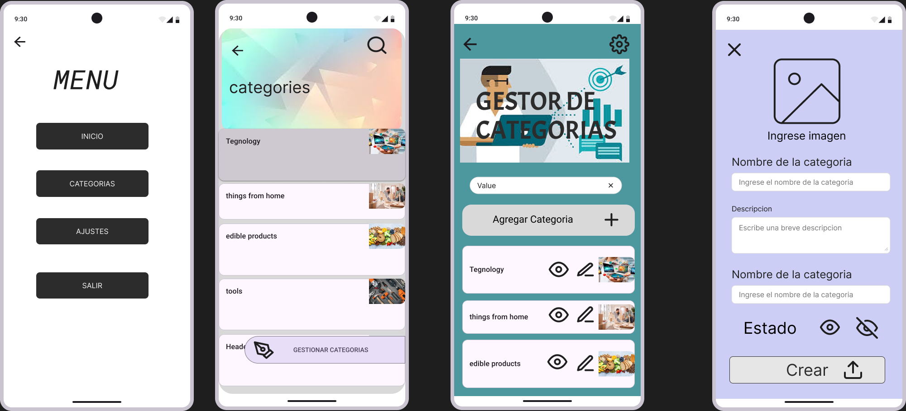

# QUE ES MOCKUP
una representación visual estática de una interfaz o producto que muestra su diseño, estructura y apariencia sin funcionalidades interactivas. Se utiliza en el desarrollo de software, diseño web y diseño de productos para visualizar cómo se verá la versión final antes de su implementación.

### Características de un Mockup:

- Presenta un diseño detallado con colores, tipografías, iconos e imágenes.
- No es interactivo (a diferencia de un prototipo).
- Sirve para revisar la estética y organización de los elementos.
- Facilita la comunicación entre diseñadores, desarrolladores y clientes.

## Ejemplo

Descripción
Como administrador del sistema,
quiero registrar, actualizar, eliminar y consultar categorías de productos,
para gestionar eficientemente la organización de los productos dentro del sistema.
### Criterios de Aceptación
 Registro de Categorías:
Se debe permitir crear una nueva categoría con los campos:
- id (generado automáticamente)
- codigo (alfanumérico único)
- nombre (obligatorio)
- descripcion (opcional)
- estado (activo/inactivo)
### Edición de Categorías:
Se debe permitir modificar el nombre, descripcion y estado de una categoría existente.
No se debe permitir modificar el id ni el codigo después de la creación.
### Eliminación de Categorías:
Se debe permitir eliminar una categoría si no está asociada a productos.
Consulta de Categorías:
- Se debe listar todas las categorías registradas.
- Se debe permitir filtrar por codigo y nombre.
### Criterios de Finalización
La funcionalidad está desarrollada y probada.
El código está revisado y aprobado en una Pull Request.
- Se ha realizado una demostración al Product Owner y ha sido aprobada.
- La documentación y pruebas están actualizadas.

## Imagen de muestra :

- [ 🎨 Figma Ejemplo ](https://www.figma.com/design/GguvacU6qFw5DrSmSoLWeQ/Ejemplo?node-id=0-1&t=FpKrp4VjNgRUKsEf-1)

La imagen muestra lo mas necesario que se esta pidiendo en el ejemplo , pero hay que recalcar que falta mas cosas para poder cumplir por completo con lo que se esta pidiendo en el ejemplo.

